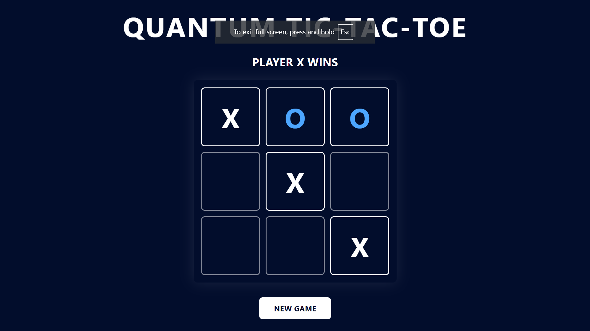

# React + Vite Template

A modern React template for web applications and games, featuring React 18, Vite, TailwindCSS, and Material UI.

## Game Preview



Experience the classic game of Tic-Tac-Toe with a modern, sleek interface. Features include:
- Clean and responsive design
- Player turn tracking
- Win detection
- New game functionality
- Fullscreen mode support

## Live Demo

Check out the live demo: [Quantum Tic-Tac-Toe](https://quantum-tictactoe-react.vercel.app/)

## Project Structure

```
├── src/
│   ├── App.jsx          # Main application component
│   ├── main.jsx         # Application entry point
│   └── index.css        # Global styles (Tailwind)
├── public/              # Static assets
├── index.html           # HTML template
├── vite.config.js       # Vite configuration
├── tailwind.config.js   # Tailwind configuration
├── postcss.config.js    # PostCSS configuration
└── eslint.config.js     # ESLint configuration
```

## Development Guidelines

- Modify `index.html` and `src/App.jsx` as needed
- Create new folders or files in `src/` directory as needed
- Style components using TailwindCSS utility classes
- Avoid modifying `src/main.jsx` and `src/index.css`
- Only modify `vite.config.js` if absolutely necessary

## Available Scripts
- `pnpm install` - Install dependencies
- `pnpm run dev` - Start development server
- `pnpm run lint` - Lint source files

## Tech Stack

- React
- Vite
- TailwindCSS
- ESLint
- Javascript
